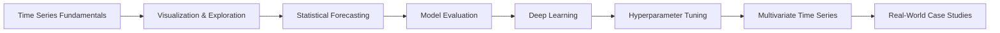

# ⏱️ Time Series Forecasting dengan Python: ARIMA, SARIMA & LSTM

Repository ini berisi informasi pendukung untuk course **Time Series Forecasting dengan Python: ARIMA, SARIMA & LSTM**.

Course membahas analisis dan forecasting data time series menggunakan Python, mulai dari pemahaman pola temporal hingga model statistik, deep learning, evaluasi model, hyperparameter tuning, dan multivariate time series.

> 🎓 **Full course tersedia di Udemy**  
> [Time Series Forecasting dengan Python: ARIMA, SARIMA & LSTM](https://www.udemy.com/course/ilmudata-time-series/?referralCode=55F2B83A1EC609F3ED62)

---

## 📌 Apa yang Dipelajari

Course ini mencakup workflow time series secara bertahap, mulai dari eksplorasi data hingga forecasting dan evaluasi model.

Topik utama meliputi:

- 📈 Trend, seasonality, cyclic pattern, dan residual
- 🔄 Autocorrelation dan partial autocorrelation
- 🧪 Stationary vs non-stationary data
- 🧹 Missing values, outlier, differencing, rolling window, dan transformasi data
- 📊 Visualisasi dan eksplorasi data time series
- 🤖 AR, MA, ARIMA, SARIMA, ARIMAX, SARIMAX, dan Exponential Smoothing
- 🔮 Prophet untuk forecasting time series
- 🧠 Deep Learning dengan RNN, LSTM, dan GRU
- ⚙️ Hyperparameter tuning dengan Grid Search, Random Search, dan Hyperopt
- 📉 Evaluasi forecasting menggunakan MAE, RMSE, MAPE, korelasi, dan analisis error
- 🔗 Multivariate Time Series dengan VAR, VECM, VARIMA, dan LSTM
- 🧩 Studi kasus berbasis data time series

---

## 🧭 Learning Path

---

## 🧪 Model yang Dibahas

### Statistical Forecasting

- Autoregression (AR)
- Moving Average (MA)
- ARIMA
- SARIMA
- ARIMAX
- SARIMAX
- Exponential Smoothing / ETS
- Prophet

### Deep Learning

- Recurrent Neural Network (RNN)
- Long Short-Term Memory (LSTM)
- Gated Recurrent Unit (GRU)

### Multivariate Time Series

- Vector Autoregression (VAR)
- Vector Error Correction Model (VECM)
- VARIMA / Multivariate ARIMA
- Cointegrated VAR
- Multivariate LSTM

---

## 🧩 Studi Kasus

Beberapa studi kasus yang digunakan dalam course:

- 🌡️ Analisis dan prediksi temperatur harian
- 🌐 Analisis dan prediksi penggunaan bandwidth jaringan
- 📈 Analisis dan prediksi data perdagangan saham

Studi kasus digunakan untuk memperlihatkan bagaimana konsep time series diterapkan pada data dengan karakteristik yang berbeda.

---

## 👥 Untuk Siapa Course Ini?

Course ini cocok untuk:

- Data Analyst yang ingin mempelajari forecasting
- Data Scientist yang ingin memperkuat pemahaman time series
- Python Developer yang membangun aplikasi berbasis prediksi
- Engineer yang bekerja dengan data sensor, monitoring, traffic, atau telemetry
- Mahasiswa dan profesional yang ingin memahami ARIMA, SARIMA, LSTM, dan multivariate forecasting

**Level:** All Levels  
Pemahaman dasar Python dan pengolahan data akan membantu, tetapi materi time series dibangun mulai dari fundamental.

---

## 🎯 Fokus Course

Tujuan course bukan hanya menghasilkan grafik prediksi, tetapi memahami proses forecasting secara lebih utuh:

**Understand the data → Build the model → Evaluate the forecast → Improve the model → Apply it to real data.**

Model yang lebih kompleks tidak selalu menghasilkan forecast yang lebih baik. Pemahaman terhadap karakteristik data, evaluasi yang benar, dan pemilihan model yang sesuai tetap menjadi bagian penting dari workflow time series.

---

## 🎓 Full Course

Materi lengkap, video lecture, demonstrasi, dan implementasi tersedia di Udemy:

👉 **[Time Series Forecasting dengan Python: ARIMA, SARIMA & LSTM](https://www.udemy.com/course/ilmudata-time-series/?referralCode=55F2B83A1EC609F3ED62)**

---

## 📚 Course Language

🇮🇩 Bahasa Indonesia

---

## 📄 License

Repository ini digunakan sebagai materi informasi dan pendukung course. Hak cipta materi course tetap berada pada pemilik course.
